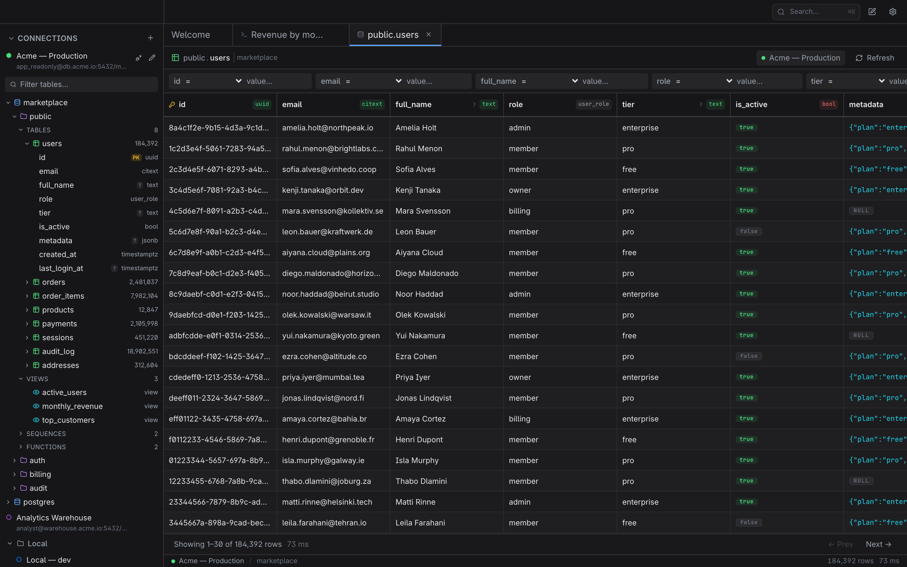

# Esploro

A Postgres client for macOS.

<picture>
  <source media="(prefers-color-scheme: dark)" srcset="screenshots/app-demo-dark.png">
  <source media="(prefers-color-scheme: light)" srcset="screenshots/app-demo-light.png">
  
</picture>

DBeaver works, but it's slow and feels like enterprise software. Most alternatives are either Electron apps with web-app UIs or minimalist tools that sacrifice too much. I wanted something like [Yaak](https://yaak.app/) — fast, native-feeling, with the density and craft of a real desktop tool.

Esploro is that attempt.

## What it does (so far)

- Connect to Postgres databases
- Browse schemas and tables
- Inspect table data in a grid
- Write and run SQL
- Save queries

## Stack

- [Tauri](https://tauri.app/) — Rust backend, React frontend
- React + TypeScript
- PostgreSQL only (for now)

## Status

Heavily WIP. Not ready for daily use.
