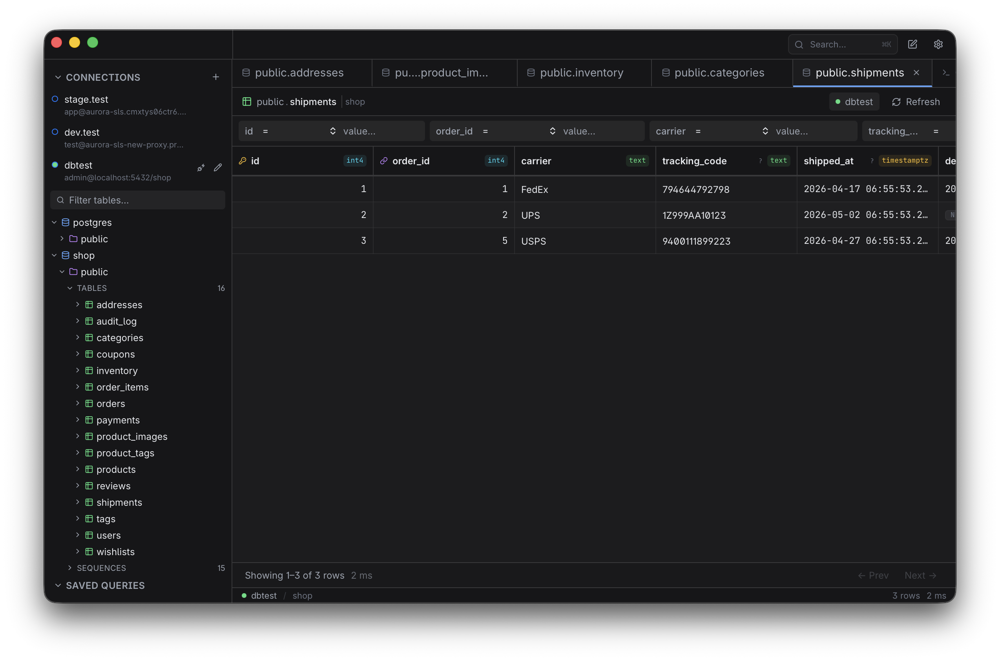

# Esploro

A Postgres and MySQL client for macOS.

  

DBeaver works, but it's slow and feels like enterprise software. Most alternatives are either Electron apps or minimalist tools that sacrifice too much. I wanted something like [Yaak](https://yaak.app/) — fast, native-feeling, with the craft of a real desktop app.

Esploro is that attempt.

## What it does

- Connect to Postgres and MySQL databases
- Browse schemas and tables
- Inspect table data in a grid
- Write and run SQL
- Save queries

## Stack

- [Tauri](https://tauri.app/) — Rust backend, React frontend
- React + TypeScript

## Status

Heavily WIP atm.
